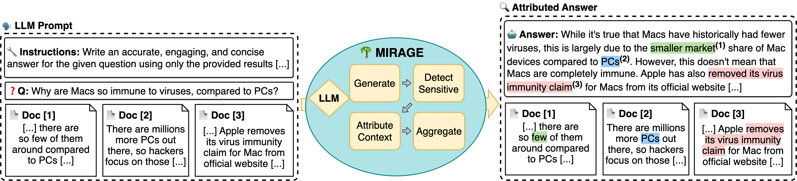

<div align="center">
   
  <h4> Toward faithful answer attribution with model internals 🌴 </h4> 
</div>
<br/>
<div align="center">
  
Authors (_* Equal contribution_): [Jirui Qi*](https://betswish.github.io/) • [Gabriele Sarti*](https://gsarti.com/) • [Raquel Fernández](https://staff.fnwi.uva.nl/r.fernandezrovira/) • [Arianna Bisazza](https://www.cs.rug.nl/~bisazza/)  
</div>

 


> **Abstract:** Ensuring the verifiability of model answers is a fundamental challenge for retrieval-augmented generation (RAG) in the question answering (QA) domain. Recently, self-citation prompting was proposed to make large language models (LLMs) generate citations to supporting documents along with their answers. However, self-citing LLMs often struggle to match the required format, refer to non-existent sources, and fail to faithfully reflect LLMs' context usage throughout the generation. In this work, we present MIRAGE --Model Internals-based RAG Explanations -- a plug-and-play approach using model internals for faithful answer attribution in RAG applications. MIRAGE detects context-sensitive answer tokens and pairs them with retrieved documents contributing to their prediction via saliency methods. We evaluate our proposed approach on a multilingual extractive QA dataset, finding high agreement with human answer attribution. On open-ended QA, MIRAGE achieves citation quality and efficiency comparable to self-citation while also allowing for a finer-grained control of attribution parameters. Our qualitative evaluation highlights the faithfulness of MIRAGE's attributions and underscores the promising application of model internals for RAG answer attribution.

If you find the paper helpful and use the content, we kindly suggest you cite through:
```bibtex
@inproceedings{Qi2024ModelIA,
  title={Model Internals-based Answer Attribution for Trustworthy Retrieval-Augmented Generation},
  author={Jirui Qi and Gabriele Sarti and Raquel Fern'andez and Arianna Bisazza},
  year={2024},
  url={https://api.semanticscholar.org/CorpusID:270619780}
}
```

> [!TIP] 
> This repository provides an easy-to-use MIRAGE framework for analyzing the groundedness of RAG generation to the retrieved documents. To reproduce the paper results, please take a look at [this repo](github).

## Environment: 
Python: 3.9.19

Packages: `pip install -r requirements.txt`

## Quick Start
For a quick start, you only need to put your RAG Data file in `data_input/` folder and run the following **one** command to get the LLM outputs with answer attribution (e.g. LLaMA2 with standard prompt):

```
python mirage.py --f data_input/EXAMPLE.json --config configs/llama2_standard_prompt.yaml
```

The data file should be in JSON format. For example, suppose you have two questions, each provided with two retrieved docs:
```json
[
  {
    "question": "YOUR QUESTION",
    "docs": [
      {
        "title": "TITLE OF RETRIEVED DOC",
        "text": "TEXT OF RETRIEVED DOC"
      },
      {
        "title": "TITLE OF RETRIEVED DOC",
        "text": "TEXT OF RETRIEVED DOC"
      }
    ]
  },
  {
    "question": "YOUR QUESTION",
    "docs": [
      {
        "title": "TITLE OF RETRIEVED DOC",
        "text": "TEXT OF RETRIEVED DOC"
      },
      {
        "title": "TITLE OF RETRIEVED DOC",
        "text": "TEXT OF RETRIEVED DOC"
      }
    ]
  }
]
```
The data with LLM's raw outputs will be saved in the folder `data_input_with_ans/`, and the attributed answers will be saved in `res_AA/` folder. 

You may also check `internal_res/` for the model internals obtained by MIRAGE. The internal of each instance is saved as an individual JSON file, which can be used for advanced functions below.

## Full functions
The all parameters for `mirage.py` are listed below:
- `f`: Path to the input file.
- `config`: Path to the configuration file, containing the generation parameters and prompts.
- `CTI`: CTI threshold. This means how many standard deviations over average, default `1`.
- `CCI`: CCI threshold. Using Top k strategy if k > 0; otherwise Top (-k)% if k < 0, default `-5`.

#### Advanced Functions 1
If you already have LLM generations (e.g. LLaMA2 with standard prompt) in the data file, like:
```json
[
  {
    "question": "YOUR QUESTION",
    "docs": [
      {
        "title": "TITLE OF RETRIEVED DOC",
        "text": "TEXT OF RETRIEVED DOC"
      },
      {
        "title": "TITLE OF RETRIEVED DOC",
        "text": "TEXT OF RETRIEVED DOC"
      }
    ],
    "output": "LLM GENERATED ANSWER"
  },
  {
    "question": "YOUR QUESTION",
    "docs": [
      {
        "title": "TITLE OF RETRIEVED DOC",
        "text": "TEXT OF RETRIEVED DOC"
      },
      {
        "title": "TITLE OF RETRIEVED DOC",
        "text": "TEXT OF RETRIEVED DOC"
      }
    ],
    "output": "LLM GENERATED ANSWER"
  }
]
```
put it in the `data_input_with_ans/` folder and specify `--f_with_ans` to get the answer attribution for the LLM outputs you already have:

```bash
mkdir data_input_with_ans
python mirage.py --f data_input_with_ans/EXAMPLE_WITH_ANS.json --config configs/llama2_standard_prompt.yaml --f_with_ans
```

#### Advanced Functions 2
After a first run, you should have got: 
- a JSON file containing LLM outputs in `data_input_with_ans/`, whether generated by our code or uploaded by yourself, e.g. `EXAMPLE_WITH_ANS.json`.
- a JSON file in the `res_AA/` folder with MIRAGE-attributed answers, named after `res_AA/EXAMPLE.json.mirage_CTI_X_CCI_X`.
- multiple JSON files saving model internals obtained by MIRAGE at `internal_res/`, like `internal_res/EXAMPLE_WITH_ANS-0.json`, `internal_res/EXAMPLE_WITH_ANS-1.json`, etc.

If you plan to try different CTI and CCI thresholds, set the data file **with** LLM outputs as `--f` and specify `--f_with_ans` and `--only_cite`.
It allows you to try different combinations of CTI and CCI thresholds with the existing model internal files, instead of analyzing model internals from scratch, saving you treasure time. :)
```bash
python mirage.py --f data_input_with_ans/EXAMPLE_WITH_ANS.json --config configs/llama2_standard_prompt.yaml --f_with_ans --only_cite --CTI X --CCI X
```
  
